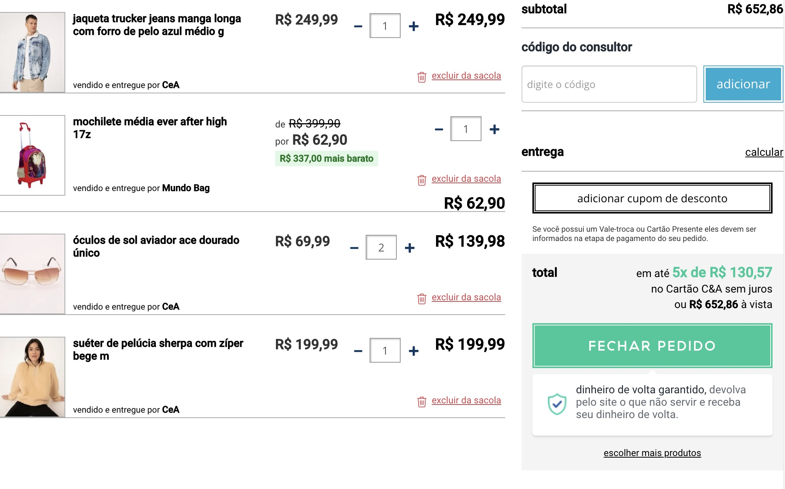

## Resumo Lista 3 de Exercício Javascript - 04-07-2022

> ### 1 - Crie uma função que escreva uma mensagem informando se um número é par ou ímpar.
```
Exemplo 1:  
    Entrada:  
        2  
    Saída:  
        O número 2 é par  
Exemplo 2:  
    Entrada:  
        77  
    Saída:  
        O número 77 é ímpar  
```

```
let parImpar = (numero) => {
    console.log(`O número ${numero} é`, numero % 2 === 0 ? 'par' : 'impar');
}

let numero = 10;
parImpar(numero);
```
<br>
  
> ### 2 - Crie uma nova função semelhante ao exercício anterior, porém agora ela deve retornar o texto que será usado por um console.log.
```
Exemplo 1:
    Entrada:
        2
    Saída:
        identificaParOuImpar(2) // retorna "par"
        O número 2 é par // retorno do console.log que chama a função
```

```
let identificaParOuImpar = (numero) => {
    return numero % 2 === 0 ? 'par' : 'impar';
}

let numero = 10;
console.log(`O número ${numero} é`, identificaParOuImpar(numero));
```
<br>

> ### 3 - Crie uma função que inverte a ordem dos itens de um array:
```
Exemplo 1:
    Entrada:
        ["Abacaxi", "Uva", "Banana", "Maçã", "Goiaba"]
    Saída:
        ["Goiaba", "Maçã", "Banana", "Uva", "Abacaxi"]

    Exemplo 2:
        Entrada:
            [10, 2, 45, 87, 99, 20, 1, 3]
        Saída:
            [3, 1, 20, 99, 87, 45, 2, 10]
```

```
let inverterArray = (arr) => {
    let arr2 = [];
    // A função shift adiciona o elemento no início do array, enquando a função push adiciona no final.
    for (let i in arr) arr2.unshift(arr[i])
    return arr2;
}

let arr = ['Abacaxi', 'Uva', 'Banana', 'Maçã', 'Goiaba'];
console.log(arr, '=>', inverterArray(arr));
```
<br>

> ### 4 - Crie uma função que retorne a soma entre dois números.
```
Exemplo 1:
    Entrada:
        soma(3, 4)
    Saída:
        3 + 4 = 7
```

```
let soma = (a, b) => {
    return a + b;
}

let a = 3, b = 4;
console.log(`${a} + ${b} = ${soma(a, b)}`);
```
<br>

> ### 5 - Faça uma função que irá receber um array de ingredientes e retornar um log com a mensagem de saída:
```
Exemplo 1:
    Entrada:
        ["Pão", "Carne", "ovo", "bacon", "Mussarela", "Presunto", "Alface", "Tomate", "Batata Palha"]
    Saída:
        Pão, Carne, ovo, bacon, Mussarela, Presunto, Alface, Tomate e Batata Palha
```

```
let mostraIngredientes = (ingredientes) => {
    let resultado = ingredientes.reduce((resultado, ingrediente, index, arr) => {
        // Perceba que o último item não é separado por vírgula, mas sim pela letra "e"
        if (index != arr.length - 1) return resultado + ', ' + ingrediente;
        else return resultado + ' e ' + ingrediente;
    });
    console.log(resultado);
}

let ingredientes = ['Pão', 'Carne', 'Ovo', 'Bacon', 'Mussarela', 'Presunto', 'Alface', 'Tomate', 'Batata Palha'];

mostraIngredientes(ingredientes);
```
<br>

> ### 6 - Complemente o exercício anterior com outra função que quando chamada irá adicionar o ingrediente informado como parâmetro ao array de ingredientes e escreve uma nova mensagem de saída:
```
Exemplo 1:
    Entrada: 
        array: ["Pão", "Carne", "ovo", "bacon", "Mussarela", "Presunto", "Alface", "Tomate", "Batata Palha"]
        adicionarIngrediente("Milho")
    Saída:
        Pão, Carne, ovo, bacon, Mussarela, Presunto, Alface, Tomate, Batata Palha e Milho
```

```
let mostraIngredientes = (ingredientes) => {
    let resultado = ingredientes.reduce((resultado, ingrediente, index, arr) => {
        if (index != arr.length - 1) return resultado + ', ' + ingrediente;
        else return resultado + ' e ' + ingrediente;
    });
    console.log(resultado);
}

let ingredientes = ['Pão', 'Carne', 'Ovo', 'Bacon', 'Mussarela', 'Presunto', 'Alface', 'Tomate', 'Batata Palha'];

let adicionarIngrediente = (ingrediente) => {
    ingredientes.push('Milho');
    mostraIngredientes(ingredientes);
}

adicionarIngrediente('Milho');
```
<br>

> ### 7 - Crie uma função que receba os dados: Nome, idade e endereço e retorne um objeto com essas propriedades.
```
Exemplo 1:
    Entrada: 
        preencherNome("Camila", 23, "Rua dos Andradas, 21")
    Saída:
        {
            nome: "Camila",
            idade: 23,
            endereco: "Rua dos Andradas, 21"
        }
```

```
let preencherNome = (nome, idade, endereco) => {
    return { nome: nome, idade: idade, endereco: endereco }
};

preencherNome('Camila', 23, 'Rua dos andradas, 21');
```
<br>

> ### 8 - Crie uma função que retorne a soma de todas as quantidades exibidas no carrinho abaixo:
<p align="center">
  
</p>

```
let quantidades = (cesta) => {
    return cesta.reduce((resultado, produto, index, arr) => resultado + produto.quantidade, 0)
}

let produto1 = {
    descricao: 'jaqueta trucker jeans manga longa com forro de pelo azul médio g',
    valor: 249.99, valor_original: 249.99, empresa: 'C&A', quantidade: 1, imagem: 'link para foto'
}

let produto2 = {
    descricao: 'mochila média ever after high 17z',
    valor: 62.90, valor_original: 399.99, empresa: 'Mundo Bag', quantidade: 1, imagem: 'link para foto'
}

let produto3 = {
    descricao: 'óculos de sol aviador ace dourado único',
    valor: 69.99, valor_original: 69.99, empresa: 'C&A', quantidade: 2, imagem: 'link para foto'
}

let produto4 = {
    descricao: 'suéter de pelúcia sharpe com zíper bege m',
    valor: 199.99, valor_original: 199.99, empresa: 'C&A', quantidade: 1, imagem: 'link para foto'
}

let cesta = [produto1, produto2, produto3, produto4]

console.log(quantidades(cesta));
```
<br>

> ### 9 - Crie as funções acima utilizando array functions
<br>

```
// já feito com array functions 
```
<br>

> ### 10 - Faça uma função que retorne o dobre dos números do array abaixo.
```
[ 0, 2, 98, 75, 23, 18, 31, 7, 1 ]
```

```
let dobro = (arr) => {
    return arr.map((x) => x * 2);
}

let numeros = [0, 2, 98, 75, 23, 18, 31, 7, 1]

dobro(numeros)
```
<br>

> ### 11 - Faça uma função que retorne todas as frutas que tenham a letra "o"
```
[ "Abacaxi", "Uva", "Maçã", "Goiaba", "Abacate", "Acerola"]
```

```
let temO = (frutas) => {
	// Utilizando toLowerCase() para considerar maiusculas também
    return frutas.filter((fruta) => fruta.toLowerCase().indexOf('o') > -1);
}

let frutas = ['Abacaxi', 'Uva', 'Maçã', 'Goiaba', 'Abacate', 'Acerola']

temO(frutas);
```
<br>

> ### 12 - Faça uma função que retorne a primeira fruta que tenha a letra "o" 
```
[ "Abacaxi", "Uva", "Maçã", "Goiaba", "Abacate", "Acerola"]
```

```
let primeiraO = (frutas) => {
    return frutas.find((fruta) => fruta.toLowerCase().indexOf('o') > -1);
}

let frutas = ['Abacaxi', 'Uva', 'Maçã', 'Goiaba', 'Abacate', 'Acerola']

primeiraO(frutas);
```
<br>

> ### 13 - Faça o somatório de todos os valores do array abaixo, utilizando reduce
```
[1, 2, 3, 4, 5, 6]
```

```
let soma = (numeros) => {
    return numeros.reduce((total, x) => total + x, 0);
}

let numeros = [1, 2, 3, 4, 5, 6];
soma(numeros);
```
<br>

> ### 14 - Faça uma função que retorne apenas as idades das pessoas, dado o objeto abaixo:
```
    [
        { name: 'Camila', age: 17 },
        { name: 'Jorge', age: 13 },
        { name: 'Marcia', age: 56 },
        { name: 'Barbara', age: 24 },
        { name: 'Natan', age: 67 },
        { name: 'Pablo', age: 65 }
    ];
```

```
let idades = (arr) => {
    return arr.map((pessoa) => pessoa.age);
}

let arr = [
    { name: 'Camila', age: 17 },
    { name: 'Jorge', age: 13 },
    { name: 'Marcia', age: 56 },
    { name: 'Barbara', age: 24 },
    { name: 'Natan', age: 67 },
    { name: 'Pablo', age: 65 }
]

idades(arr);
```
<br>

> ### 15 - Resolver as funções anteriores agora utilizando apenas array function
```
// já estão com array function 
```
<br>

> ### 16.1 - Crie uma função que una os objetos abaixo em um outro objeto chamado pessoa
```
primeiroNome: { nome: 'João' }
sobrenome: { sobrenome: 'da Silva' }
```

```
let unirNome = (nome, sobrenome) => Object.assign({}, primeiroNome, sobrenome);

let primeiroNome = { nome: 'João' }, sobrenome = { sobrenome: 'da Silva' };

let pessoa = unirNome(primeiroNome, sobrenome);
```
<br>

> ### 16.2 - Crie uma função que crie um novo objeto alterando apenas as propriedades abaixo:
```
produto: {
    nome: "X-Tudo",
    ingredientes: ["Pão", "Carne", "ovo", "bacon", "Mussarela", "Presunto", "Alface", "Tomate", "Batata Palha"],
    servePessoas: 1,
    valor: 24.98,
    valorPromocional: 16.98,
    maisVendido: true
}

Alterar o valor do produto para 35.00 e o valor promocional deve ser o valor do produto com 10% de desconto.
```

```
let mudarValor = (produto, valor, desconto) => {
    return Object.assign({}, produto, {
        valor: valor,
        valorPromocional: valor * (1 - desconto / 100)
    });
}

let produto = {
    nome: 'X-tudo',
    ingredientes: ['Pão', 'Carne', 'ovo', 'bacon', 'Mussarela', 'Presunto', 'Alface', 'Tomate', 'Batata Palha'],
    servePessoas: 1,
    valor: 24.98,
    valorPromocional: 16.98,
    maisVendido: true
}

produto = mudarValor(produto, 35.00, 10)
```
<br>

> ### 17 - Faça uma função que retorne o primeiro produto com valor entre 50 e 60 reais.

<p align="center">
  
</p>

```
let filtro_preco = (cesta) => cesta.filter((produto) => produto.preco >= 50 && produto.preco < 60)

let cesta = [
    { quantidade: 1, descricao: 'Desafios e Enigmas ...', vendido: 'Amazon', preco: 47.20 },
    { quantidade: 1, descricao: 'Mulheres que correm ...', vendido: 'Amazon', preco: 37.90 },
    { quantidade: 1, descricao: 'O oráculo da noite ...', vendido: 'Amazon', preco: 66.31 },
    { quantidade: 1, descricao: 'Seja homem: ...', vendido: 'Amazon', preco: 53.71 },
    { quantidade: 1, descricao: 'Mulheres incríveis ...', vendido: 'Amazon', preco: 14.37 },
    { quantidade: 1, descricao: 'A ciranda das mulheres ...', vendido: 'Amazon', preco: 13.90 },
    { quantidade: 1, descricao: 'Sociedade do cansaço', vendido: 'Amazon', preco: 23.20 },
    { quantidade: 1, descricao: 'Como o racismo ...', vendido: 'Amazon', preco: 24.99 }
]

filtro_preco(cesta)
```
<br>

> ###
```

```

```

```
<br>

