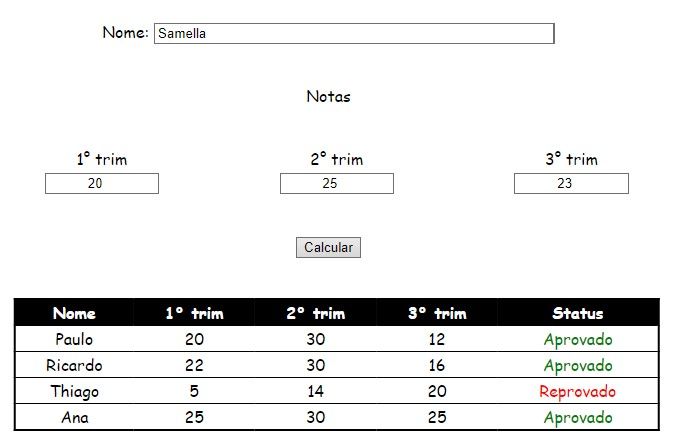

[](https://www.linkedin.com/in/marcus-vinicius-de-miranda)
[](https://www.instagram.com/marcusmiran/)
[](https://www.twitch.tv/lyazmat)

> ## Calcular Notas
<br>
<p align="center">
  
</p>
<br>

```html
<!DOCTYPE html>
<html lang="en">

<head>
    <meta charset="UTF-8">
    <meta http-equiv="X-UA-Compatible" content="IE=edge">
    <meta name="viewport" content="width=device-width, initial-scale=1.0">
    <title>Document</title>
    <link rel="stylesheet" href="notas.css">    
    <script src="https://code.jquery.com/jquery-3.6.0.min.js" 
    integrity="sha256-/xUj+3OJU5yExlq6GSYGSHk7tPXikynS7ogEvDej/m4=" crossorigin="anonymous"></script>
</head>

<body>
    <div class="nome">
        Nome: <input id="nome" name="nome" value="" type="text">
    </div>
    <div>
        Notas
    </div>
    <div class="notas">
        <div>1° trim<br><input id="p-trim" name="p-trim" value="" type="number"></div>
        <div>2° trim<br><input id="s-trim" name="s-trim" value="" type="number"></div>
        <div>3° trim<br><input id="t-trim" name="t-trim" value="" type="number"></div>
    </div>
    <div>
        <button id="calcular">Calcular</button>
    </div>

    <div class="div-tabela">
        <table id="tabela">
            <thead>
                <tr>
                    <th>Nome</th>
                    <th>1° trim</th>
                    <th>2° trim</th>
                    <th>3° trim</th>
                    <th>Status</th>
                </tr>
            </thead>
            <tbody>
                <tr>
                    <td>Paulo</td>
                    <td>20</td>
                    <td>30</td>
                    <td>12</td>
                    <td><span class="aprovado">Aprovado</span></td>
                </tr>
            </tbody>
        </table>
    </div>
    <script src="notas.js" type="text/javascript"></script>
</body>

</html>
```

```css
body {
    font-family: cursive, fantasy, Arial;
    text-align: center;
}

div {
    margin-top: 20px;
    margin-bottom: 20px;
}

div.nome {
    margin-top: 10vh !important;
    margin-bottom: 40px !important;
}

#nome {
    width: 30%;
}

.notas {
    display: flex;
    justify-content: space-between;
    margin-left: 50vw;
    transform: translate(-50%);
}

.notas div {
    display: inline-block;
    text-align: center;
}

.notas input {
    width: 60%;    
    text-align: center;
}

.div-tabela {
    margin-top: 40px;
    margin-left: 50vw;
    transform: translate(-50%);
}

table {
    width: 100%;
    text-align: center;
    border: 2px solid black;
    border-collapse: collapse;
}

tr,
td {
    border-top: 1px solid black;
    border-bottom: 1px solid black;
}

th {
    background-color: black;
    border-left: 0;
    border-right: 0;
}

thead {
    background-color: black;
    color: white;
}


span.aprovado {
    color: green;
}

span.reprovado {
    color: red;
}
```

```javascript
$(function() {

    $('#calcular').click(function() {
        let nome = $('#nome').val(),
            pTrim = $('#p-trim').val(),
            sTrim = $('#s-trim').val(),
            tTrim = $('#t-trim').val();
        if ([nome, pTrim, sTrim, tTrim].every(x => x !== '')) {
            let media = +pTrim + +sTrim + +tTrim;
            let status = media < 60 ?
                '<span class="reprovado">Reprovado</span>' :
                '<span class="aprovado">Aprovado</span>';
            let linha = `<tr>
                            <td>${nome}</td>
                            <td>${pTrim}</td>
                            <td>${sTrim}</td>
                            <td>${tTrim}</td>
                            <td>${status}</td>
                        </tr>`;
            $('#tabela tbody tr:last').after(linha);
            $('input').val('');
        } else alert('Informe os valores!');
    });

});
```