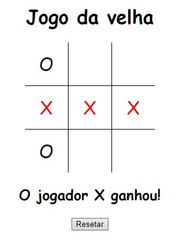

[](https://www.linkedin.com/in/marcus-vinicius-de-miranda)
[](https://www.instagram.com/marcusmiran/)
[](https://www.twitch.tv/lyazmat)

> ## Jogo da Velha
<br>
<p align="center">
  
</p>
<br>

```html
<!DOCTYPE html>
<html lang="en">

<head>
    <meta charset="UTF-8">
    <meta http-equiv="X-UA-Compatible" content="IE=edge">
    <meta name="viewport" content="width=device-width, initial-scale=1.0">
    <title>Document</title>
    <link href="velha.css" rel="stylesheet">
</head>

<body>
    <h1 style="text-align: center;">Jogo da velha</h1>

    <div class="div-tabela">
        <table>
            <tr>
                <td>
                    <div class="cedula" id="v-1-1"></div>
                </td>
                <td>
                    <div class="cedula" id="v-1-2"></div>
                </td>
                <td>
                    <div class="cedula" id="v-1-3"></div>
                </td>
            </tr>
            <tr>
                <td>
                    <div class="cedula" id="v-2-1"></div>
                </td>
                <td>
                    <div class="cedula" id="v-2-2"></div>
                </td>
                <td>
                    <div class="cedula" id="v-2-3"></div>
                </td>
            </tr>
            <tr>
                <td>
                    <div class="cedula" id="v-3-1"></div>
                </td>
                <td>
                    <div class="cedula" id="v-3-2"></div>
                </td>
                <td>
                    <div class="cedula" id="v-3-3"></div>
                </td>
            </tr>
        </table>
        <h2></h2>
        <button class="botao" type="button">Resetar</button>
    </div>

    <script src="https://code.jquery.com/jquery-3.6.0.min.js"
    integrity="sha256-/xUj+3OJU5yExlq6GSYGSHk7tPXikynS7ogEvDej/m4="
    crossorigin="anonymous"></script>
    <script src="velha.js" type="text/javascript"></script>
</body>

</html>
```

```css
body {
    font-family: cursive, fantasy, Arial;
}

table {
    border-collapse: collapse;    
}

table td {
    border: 1px solid black;
    font-size: 30px;
}

table tr:first-child td {
    border-top: 0;
}

table tr:last-child td {
    border-bottom: 0;
}

table tr td:first-child {
    border-left: 0;
}

table tr td:last-child {
    border-right: 0;
}

table {
    width: 210px;
    height: 210px;
    border-collapse: collapse;
    transform: translate(-50%);
}

.div-tabela {
    align-content: center;
    margin-left: 50%;
}

.cedula {
    display: flex;
    justify-content: center;
    align-items: center;
    min-width: 70px;
    min-height: 70px;
    max-width: 70px;
    max-height: 70px;
}

.red {
    color: red;
}

.botao {
    transform: translate(-50%);
}

.disabled-click {
    pointer-events: none;
    cursor: default;
    text-decoration: none;
    color: black;
}

h2 {
    transform: translate(-50%);
    text-align: center;
}
```

```javascript
$(document).ready(function() {
    // Configurações iniciais
    let jogoVelha = [],
        marcador = 'X',
        ganhador = '';

    // Array com ID's
    let posicoes = [
        ['#v-1-1', '#v-1-2', '#v-1-3'],
        ['#v-2-1', '#v-2-2', '#v-2-3'],
        ['#v-3-1', '#v-3-2', '#v-3-3']
    ]

    // Mudar variável jogoVelha sempre que marcar
    let setVelha = () => {
        jogoVelha = posicoes.map((x) => x.map((y) => $(y).html()));
    };

    // Validar marcadoes => 3 marcacoes no array significa que ganhou
    let marcacoes = (arr) => {
        if (arr.length === 3) {
            ganhador = marcador;
            arr.forEach((x) => x.addClass('red'));
        }
    }

    let validarSituacao = () => {
        // Validar Diagonal 1
        let d1 = ['#v-1-1', '#v-2-2', '#v-3-3'];
        let d1_g = d1.map((x) => $(x)).filter((x) => x.html() === marcador);
        marcacoes(d1_g);

        // Validar Diagonal 2
        let d2 = ['#v-3-1', '#v-2-2', '#v-1-3'];
        let d2_g = d2.map((x) => $(x)).filter((x) => x.html() === marcador);
        marcacoes(d2_g);

        // Validar Verticais e Horizontais
        for (let i in posicoes) {
            let h = [],
                v = [];
            for (let j in posicoes) {
                if (jogoVelha[i][j] === marcador) h.push($(posicoes[i][j]));
                if (jogoVelha[j][i] === marcador) v.push($(posicoes[j][i]));
            }
            marcacoes(h);
            marcacoes(v);
        }

        // Verificar se houve ganhador
        if (ganhador === '') {
            // Se retornar undefined significa que não há mais posições para marcar
            let velha = jogoVelha.find(x => x.reduce((b, y) => {
                if (y === '') b = true
                return b
            }, false) === true);

            if (velha === undefined) {
                $('h2').html(`Deu velha!`);
                $('table').addClass('disabled-click');
            } else marcador = marcador === 'X' ? 'O' : 'X'; // <- Muda o marcador se o jogo continuar
        } else {
            $('h2').html(`O jogador ${marcador} ganhou!`);
            $('table').addClass('disabled-click');
        }

    };

    // Validar Local, Preencher e Validar Situação
    let jogar = (element) => {
        if ($(element).html() === '') {
            $(element).html(marcador);
            setVelha();
            validarSituacao();
        } else {
            alert('Já preenchido!')
        }
    };

    // Clicar
    $(".cedula").click(function() {
        jogar(this);
    });

    // Resetar jogo
    $('.botao').click(function() {
        $('table').removeClass('disabled-click');
        $('h2').html('');
        posicoes.forEach((x) => x.forEach((y) => {
            $(y).html('');
            $(y).removeClass('red');
        }));
        jogoVelha = [];
        marcador = 'X';
        ganhador = '';
    });

});
```