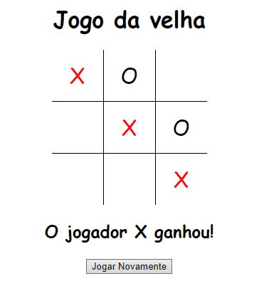

[](https://www.linkedin.com/in/marcus-vinicius-de-miranda)
[](https://www.instagram.com/marcusmiran/)
[](https://www.twitch.tv/lyazmat)

> ## Jogo da Velha
<br>
<p align="center">
  
</p>
<br>

```html
<!DOCTYPE html>
<html lang="en">

<head>
    <meta charset="UTF-8">
    <meta http-equiv="X-UA-Compatible" content="IE=edge">
    <meta name="viewport" content="width=device-width, initial-scale=1.0">
    <title>Document</title>
    <link href="velha.css" rel="stylesheet">
</head>

<body>
    <h1 style="text-align: center;">Jogo da velha</h1>

    <div class="div-tabela">
        <table>
            <tr>
                <td>
                    <div class="cedula" id="v-1-1"></div>
                </td>
                <td>
                    <div class="cedula" id="v-1-2"></div>
                </td>
                <td>
                    <div class="cedula" id="v-1-3"></div>
                </td>
            </tr>
            <tr>
                <td>
                    <div class="cedula" id="v-2-1"></div>
                </td>
                <td>
                    <div class="cedula" id="v-2-2"></div>
                </td>
                <td>
                    <div class="cedula" id="v-2-3"></div>
                </td>
            </tr>
            <tr>
                <td>
                    <div class="cedula" id="v-3-1"></div>
                </td>
                <td>
                    <div class="cedula" id="v-3-2"></div>
                </td>
                <td>
                    <div class="cedula" id="v-3-3"></div>
                </td>
            </tr>
        </table>
        <h2></h2>
        <button class="botao" type="button">Resetar</button>
    </div>

    <script src="https://code.jquery.com/jquery-3.6.0.min.js"
    integrity="sha256-/xUj+3OJU5yExlq6GSYGSHk7tPXikynS7ogEvDej/m4="
    crossorigin="anonymous"></script>
    <script src="velha.js" type="text/javascript"></script>
</body>

</html>
```

```css
body {
    font-family: cursive, fantasy, Arial;
}

table {
    border-collapse: collapse;    
}

table td {
    border: 1px solid black;
    font-size: 30px;
}

table tr:first-child td {
    border-top: 0;
}

table tr:last-child td {
    border-bottom: 0;
}

table tr td:first-child {
    border-left: 0;
}

table tr td:last-child {
    border-right: 0;
}

table {
    width: 210px;
    height: 210px;
    border-collapse: collapse;
    transform: translate(-50%);
}

.div-tabela {
    align-content: center;
    margin-left: 50%;
}

.cedula {
    display: flex;
    justify-content: center;
    align-items: center;
    min-width: 70px;
    min-height: 70px;
    max-width: 70px;
    max-height: 70px;
}

.red {
    color: red;
}

.botao {
    transform: translate(-50%);
}

.disabled-click {
    pointer-events: none;
    cursor: default;
    text-decoration: none;
    color: black;
}

h2 {
    transform: translate(-50%);
    text-align: center;
}
```

```javascript
$(document).ready(function () {

    // Validar marcadores => 3 marcações no array significa que ganhou
    let marcacoes = (arr) => {
        if (arr.length === 3) {
            ganhador = marcador;
            arr.forEach((x) => x.addClass('red'));
        }
    }

    /* 
    Configurações iniciais
    A ideia principal é atribuir a cada elemento da velha o respectivo
    elemento (em jQuery) da tabela do DOM
    */
    let marcador = 'X',
        ganhador = '',
        posicoes = [
            [$('#v-1-1'), $('#v-1-2'), $('#v-1-3')],
            [$('#v-2-1'), $('#v-2-2'), $('#v-2-3')],
            [$('#v-3-1'), $('#v-3-2'), $('#v-3-3')]
        ];

    // d1 - diagonal principal, d2 - diagonal secundaria
    let d1 = [$('#v-1-1'), $('#v-2-2'), $('#v-3-3')];
    let d2 = [$('#v-3-1'), $('#v-2-2'), $('#v-1-3')];

    // Adicionar método change para cada elemento
    posicoes.forEach((p, linha) => p.forEach((x, coluna) => {
        x.change(function () {

            // Altera o elemento no DOM com a marcação
            x.html(marcador);

            // Arrays que conterão a quantidde marcada para cada situação
            // d1_g e d2_g são verificações nas diagonais, h e v para a linha e coluna
            let d1_g = [], d2_g = [], h = [], v = [];

            // Verificar se é diagonal principal
            if (linha === coluna) d1_g = d1.filter((x) => x.html() === marcador);

            // Verificar se é diagonal secundária
            if (linha + coluna === 2) d2_g = d2.filter((x) => x.html() === marcador);

            // Verifica os elementos da linha e da coluna
            [0, 1, 2].forEach((i) => {
                if (posicoes[linha][i].html() === marcador) h.push(posicoes[linha][i]);
                if (posicoes[i][coluna].html() === marcador) v.push(posicoes[i][coluna]);
            });

            // Verificar se houve ganhador e alterar o style
            [d1_g, d2_g, h, v].forEach((arr) => marcacoes(arr));

            // Senão houve ganhador verificar se deu velha ou se o jogo continua
            if (ganhador === '') {
                // Se retornar undefined significa que não há mais posições para marcar
                let velha = posicoes.find(x => x.reduce((b, y) => {
                    if (y.html() === '') b = true
                    return b
                }, false) === true);

                if (velha === undefined) {
                    // Se deu velha, exibe que deu velha e bloqueia o jogo
                    $('h2').html(`Deu velha!`);
                    $('table').addClass('disabled-click');
                } else marcador = marcador === 'X' ? 'O' : 'X'; // <- Muda o marcador se o jogo continuar
            } else {
                // Se houve ganhador, exibe quem ganhou e bloqueia o jogo
                $('h2').html(`O jogador ${marcador} ganhou!`);
                $('table').addClass('disabled-click');
            }
        });
    }))

    // Função que chama a função change ao clicar
    $(".cedula").click(function () {
        if ($(this).html() === '') {
            $(this).change();
        } else {
            alert('Já preenchido!')
        }
    });

    // Resetar jogo
    $('.botao').click(function () {
        $('table').removeClass('disabled-click');
        $('h2').html('');
        posicoes.forEach((x) => x.forEach((y) => {
            y.html('');
            y.removeClass('red');
        }));
        marcador = 'X';
        ganhador = '';
    });

});
```