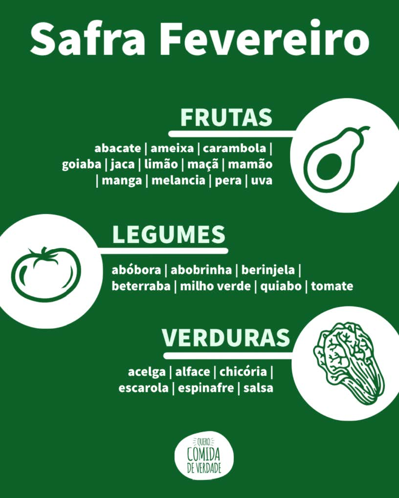
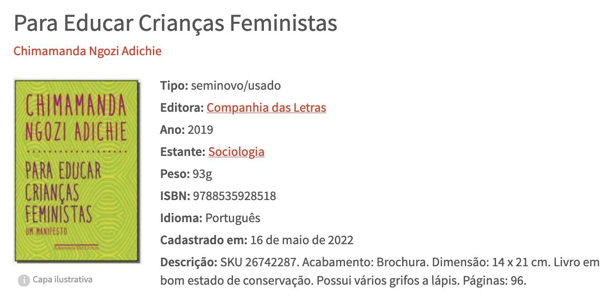

[](https://www.linkedin.com/in/marcus-vinicius-de-miranda)
[](https://www.instagram.com/marcusmiran/)
[](https://www.twitch.tv/lyazmat)

## Lista 1 de Exercício Javascript

> ### Use o typeof para identificar qual é o tipo de cada um dos valores abaixo:
```
    ● 87
    ● 21.5
    ● “FALSO”
    ● “Maria_Aparecida”
    ● true
    ● 45 + 10%2
    ● “Nome: Susi”
    ● 10 == "10"
```

```javascript
console.log(typeof(87));
console.log(typeof(21.5));
console.log(typeof("FALSO"));
console.log(typeof("Maria_Aparecida"));
console.log(typeof(true));
console.log(typeof(45 + 10 % 2));
console.log(typeof("Nome: Susi"));
console.log(typeof(10 == "10"));
```
<br>

> ### Qual o melhor tipo podemos usar para representar os dados abaixo:
```
    ● Nome de uma pessoa : string
    ● Idade : number
    ● Se a pessoa tem notebook : boolean
    ● Produto, contendo: nome e valor : object
    ● Data de Nascimento : Date (object), string, number
    ● Lista com nome de 5 frutas : array
    ● Distância em Quilômetros : number
    ● Número de Telefone : number
    ● E-mail : string
    ● Código promocional : string
```
<br>

> ### Qual é o resultado das operações abaixo:
```
    // Jogar diretamente as operações no console (operação : resultado)
    ● 1 + "1" : 11
    ● 5 - "2" : 3
    ● "a" > "B" : true
    ● 10 == "10" : true
    ● let count = 5; count++ : 5
    ● let total = 100; total *= 5 : 500
    ● let a = 0, b = 0; ++a == b++ : false
    ● let a = 0, b = 0; ++a == b+1 : true
    ● "zero" * 123 : NaN
```
<br>

> ### Qual é o resultado das expressões abaixo:
```
    // Jogar diretamente as expressões no console  (expressão : resultado)
    ● false || ( 10 % 5 * 2 != 5 * 2 + 1) : false
    ● !false || false && false : true
    ● !false && false || false : false
    ● !true && false || true : true
    ● !(true && (false || true)) : false
    ● !(true && false) || true : true
    ● !((true && false) || true) : false
```
<br>

> ### Como você representaria os dados definidos nas imagens abaixo, utilizando o mínimo possível de variáveis:

<p align="center">
  
</p>

```javascript
let safra = {
    mes: 'Fevereiro',
    frutas: ['abacate', 'ameixa', 'carambola', 'goiaba', 'jaca', 'limão', 'maça', 'mamão', 'manga', 'melancia', 'pera', 'uva'],
    legumes: ['abóbora', 'abobrinha', 'beringela', 'beterrada', 'milho verde', 'quiabo', 'tomate'],
    verduras: ['acelga', 'alface', 'chicória', 'escarola', 'espinafre', 'salsa']
}
```
<br>

<p align="center">
  
</p>

```javascript
let voo = {
    partida: '20:30',
    chegada: '21:35',
    origem: 'Rio de Janeiro (SDU)',
    destino: 'São Paulo (GRU)',
    empresa: 'GOL Linhas Aereas S.A.',
    valor: 1255,
    tipo: 'ida e volta',
    escala: false
}
```
<br>

<p align="center">
  
</p>

```javascript
let cesta = [
    {
        codigo: 1,
        descricao: 'BABY FLYER',
        produto: '117.099000-000091',
        cor: 'CAFE',
        quantidade: 24,
        valor: 56.29
    },
    {
        codigo: 2,
        descricao: 'BABY FLYER',
        produto: '117.100000-000002',
        cor: 'PRETO',
        quantidade: 12,
        valor: 48.40
    },
    {
        codigo: 3,
        descricao: 'BABY FLYER',
        produto: '117.100000-007703',
        cor: 'MOSTARDA/PRETO',
        quantidade: 24,
        valor: 48.40
    }
]
```
<br>

<p align="center">
  
</p>

```javascript
let livro = {
    titulo: 'Para Educar Crianças Feministas',
    autor: 'Chimamanda Ngozi Adichie',
    imagem: 'https://images-na.ssl-images-amazon.com/images/I/51HNpcIQoTL._SX342_BO1,204,203,200_.jpg',
    tipo: 'seminovo/usado',
    editora: 'Companhia das Letras',
    ano: 2019,
    estante: 'Sociologia',
    peso: 93,
    isbn: 9788535928518,
    idioma: 'Português',
    cadastrado: '05/16/2022',
    descricao: 'SKU 26742287. Acabamento: Brochura. Dimensão: 14 x 21 cm. Livro em bom estado de conservação. Possui vários grifos a lápis. Páginas: 96.'
}
```