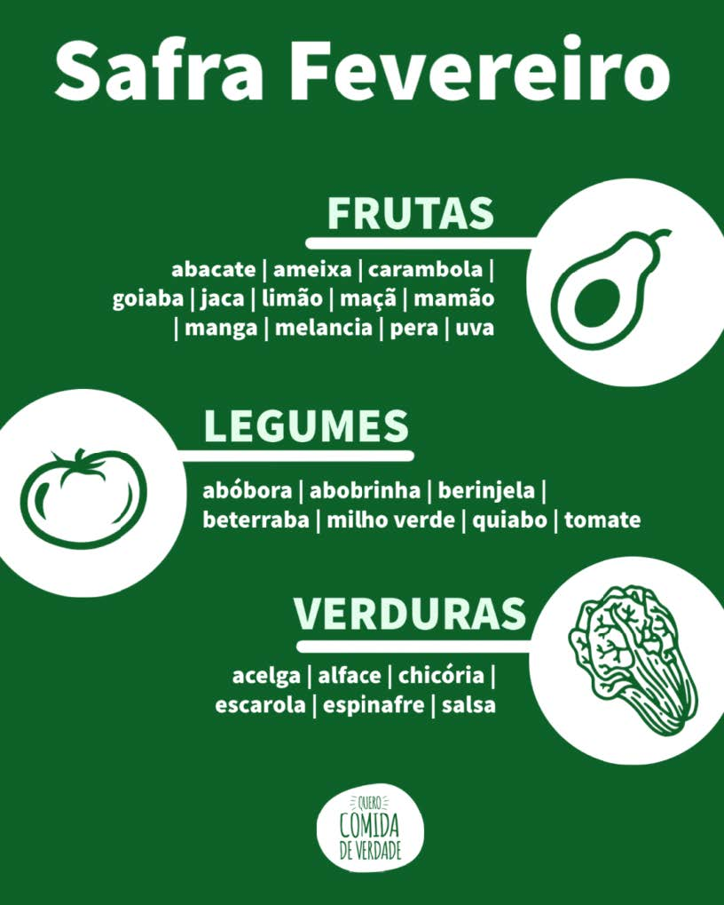
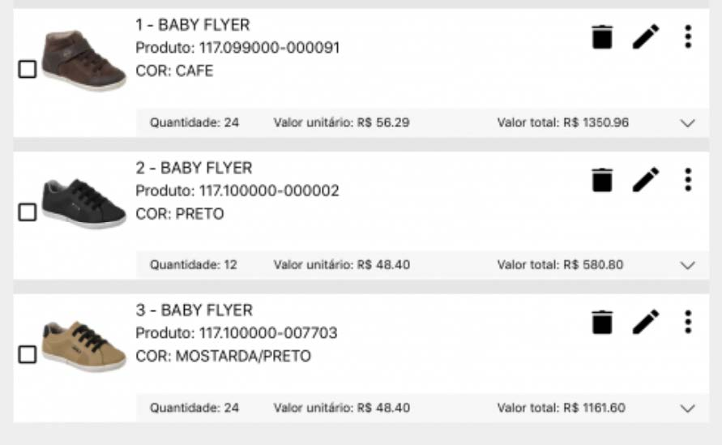
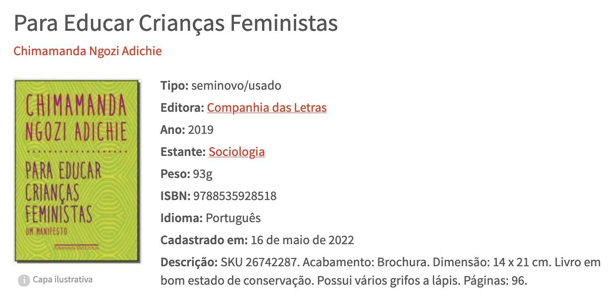
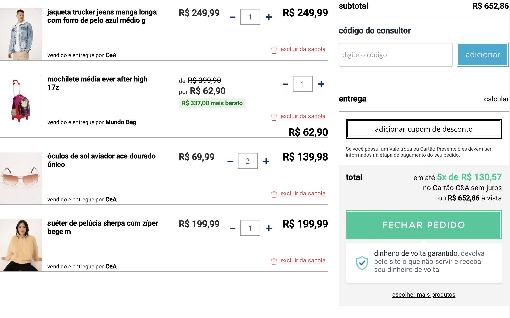

[](https://www.linkedin.com/in/marcus-vinicius-de-miranda)
[](https://www.instagram.com/marcusmiran/)
[](https://www.twitch.tv/lyazmat)

## Lista 2 de Exercício Javascript

> ### 1 - Resolva os exercícios abaixo utilizando arrays e objetos:

<p align="center">
  
</p>

```javascript
let safra = {
    mes: 'Fevereiro',
    frutas: ['abacate', 'ameixa', 'carambola', 'goiaba', 'jaca', 'limão', 'maça', 'mamão', 'manga', 'melancia', 'pera', 'uva'],
    legumes: ['abóbora', 'abobrinha', 'beringela', 'beterrada', 'milho verde', 'quiabo', 'tomate'],
    verduras: ['acelga', 'alface', 'chicória', 'escarola', 'espinafre', 'salsa']
}
```
<br>

<p align="center">
  
</p>

```javascript
let voo = {
    partida: '20:30',
    chegada: '21:35',
    origem: 'Rio de Janeiro (SDU)',
    destino: 'São Paulo (GRU)',
    empresa: 'GOL Linhas Aereas S.A.',
    valor: 1255,
    tipo: 'ida e volta',
    escala: false
}
```
<br>

<p align="center">
  
</p>

```javascript
let cesta = [
    {
        codigo: 1,
        descricao: 'BABY FLYER',
        produto: '117.099000-000091',
        cor: 'CAFE',
        quantidade: 24,
        valor: 56.29
    },
    {
        codigo: 2,
        descricao: 'BABY FLYER',
        produto: '117.100000-000002',
        cor: 'PRETO',
        quantidade: 12,
        valor: 48.40
    },
    {
        codigo: 3,
        descricao: 'BABY FLYER',
        produto: '117.100000-007703',
        cor: 'MOSTARDA/PRETO',
        quantidade: 24,
        valor: 48.40
    }
]
```
<br>

<p align="center">
  
</p>

```javascript
let livro = {
    titulo: 'Para Educar Crianças Feministas',
    autor: 'Chimamanda Ngozi Adichie',
    imagem: 'https://images-na.ssl-images-amazon.com/images/I/51HNpcIQoTL._SX342_BO1,204,203,200_.jpg',
    tipo: 'seminovo/usado',
    editora: 'Companhia das Letras',
    ano: 2019,
    estante: 'Sociologia',
    peso: 93,
    isbn: 9788535928518,
    idioma: 'Português',
    cadastrado: '05/16/2022',
    descricao: 'SKU 26742287. Acabamento: Brochura. Dimensão: 14 x 21 cm. Livro em bom estado de conservação. Possui vários grifos a lápis. Páginas: 96.'
}
```
<br>

> ### 2 - Faça um código em JS que realize a operação desejada entre os números 33 e 5, conforme um operador informado.
```
Ex: 
    O operador informado é "-" (símbolo de subtração)
    Mensagem no console: O resultado da operação de 33 - 5 é 28.

    O operador informado é o "*" ( símbolo de multiplicação)
    Mensagem no console: O resultado da operação de 33 * 5 é 165.

    Operadores possíveis: +, -, /, *, %
    Mensagens possíveis:

Deve ser informada apenas a mensagem referente ao valor do operador desejado.
```

```javascript
function operacao(operador) {
    let resultado=0;
    switch (operador) {
        case '+':
            resultado = 33 + 5
            break;
        case '-':
            resultado = 33 - 5
            break;
        case '/':
            resultado = 33 / 5
            break;
        case '*':
            resultado = 33 * 5
            break;
        case '%':
            resultado = 33 % 5
            break;
        default:
            resultado = null;
    }
    if (resultado === null) console.log('Operador não encontrado.');
    else console.log(`O resultado da operação 33 ${operador} 5 é ${resultado}.`);
}

operacao('+');
```
<br>

> ### 3- Retornar todas as frutas que tenham a letra "o"
```
[ "Abacaxi", "Uva", "Maçã", "Goiaba", "Abacate", "Acerola"]
```

```javascript
function procurar(arr) {
    let resultado = [];
    for (let i=0; i < arr.length; i++){
        for (let l=0; l < arr[i].length; l++){
            if (arr[i][l].toLowerCase() === 'o') {
                resultado.push(arr[i]);
                break;
            }
        }
    }
    return resultado;
}

let arr = [ "Abacaxi", "Uva", "Maçã", "Goiaba", "Abacate", "Acerola"];
console.log(procurar(arr));
```
<br>

> ### 4- Faça um código em JS que informe o total de horas trabalhadas no dia de uma funcionária. Considerando as regras abaixo.
```
- Caso a funcionária trabalhe menos do que 6h, não deve ser descontado do tempo total o intervalo de almoço (1h) da mesma
- Caso a funcionária trabalhe mais do que 6h, deve ser descontado do tempo total o intervalo de almoço (1h) da mesma.
```

```javascript
function total(horas){
    if (horas < 6) return horas;
    else return horas - 1;
}

// Teste com doze horas
console.log('Horas trabalhas', total(12));
```
<br>

> ### 5- Faça um código em JS que realize a soma dos números pares pertencentes ao intervalo de 1 a 100 e retorne o resultado da soma.

```javascript
let somaPares = () => {
    let resultado = 0;
    for (let i=1; i <= 100; i++){
        if (i % 2 === 0) resultado += i;
    }
    return resultado;
}

console.log(somaPares());
```
<br>

> ### 6- Faça um código em JS que retorne os números do array abaixo de forma decrescente.
```
[ 0, 2, 98, 75, 23, 18, 31, 7, 1 ]
```

```javascript
let decrescente = (arr) => {
    let resultado = [];
    for (let i in arr){
        if (i === 0) {
            resultado.push(arr[i]);
        }
        else {
            let elemento = arr[i];
            for (let j in resultado){
                if (resultado[j] < elemento){
                    let aux = resultado[j];
                    resultado[j] = elemento;
                    elemento = aux;
                }
            }
            resultado.push(elemento);
        }
    }
    return resultado;
}
let arr = [ 0, 2, 98, 75, 23, 18, 31, 7, 1 ];
console.log(decrescente(arr));
```
<br>

> ### 7- Faça um código em JS que retorne quantos dias existem entre as datas de início e fim da estrutura abaixo:
```
    [ { dateStart: '12/01/2022', dateEnd: '12/03/2022' },
    { dateStart: '27/03/2022', dateEnd: '11/04/2022' },
    { dateStart: '02/04/2022', dateEnd: '22/04/2022' },
    { dateStart: '11/05/2022', dateEnd: '12/05/2022' } ]
```

```javascript
// função para converter string dd/mm/aaaa para objeto Date
function dataBr(data){
    data = data.split('/');
    return new Date(data[1]+'/'+data[0]+'/'+data[2]);
}

function dias(arr) {
    let resultado = []
    for (i in arr) {
        let dias = (dataBr(arr[i].dateEnd) - dataBr(arr[i].dateStart)) / (1000 * 60 * 60 * 24);
        resultado.push(dias)
    }
    return resultado;
}

let arr = [ { dateStart: '12/01/2022', dateEnd: '12/03/2022' },
            { dateStart: '27/03/2022', dateEnd: '11/04/2022' },
            { dateStart: '02/04/2022', dateEnd: '22/04/2022' },
            { dateStart: '11/05/2022', dateEnd: '12/05/2022' } ];

console.log(dias(arr));
```
<br>

> ### 8- Faça um código em JS que estruture os dados, calcule e retorne o resultado do somatório da lista de compras abaixo:

<p align="center">
  
</p>

```javascript
function somatorio(cesta){
    let soma = 0;
    for (let i in cesta) soma += cesta[i].valor * cesta[i].quantidade;
    return soma;
}

let produto1 = {
    descricao: 'jaqueta trucker jeans manga longa com forro de pelo azul médio g',
    valor: 249.99, valor_original: 249.99, empresa: 'C&A', quantidade: 1, imagem: 'link para foto'
}

let produto2 = {
    descricao: 'mochila média ever after high 17z',
    valor: 62.90, valor_original: 399.99, empresa: 'Mundo Bag', quantidade: 1, imagem: 'link para foto'
}

let produto3 = {
    descricao: 'óculos de sol aviador ace dourado único',
    valor: 69.99, valor_original: 69.99, empresa: 'C&A', quantidade: 2, imagem: 'link para foto'
}

let produto4 = {
    descricao: 'suéter de pelúcia sharpe com zíper bege m',
    valor: 199.99, valor_original: 199.99, empresa: 'C&A', quantidade: 1, imagem: 'link para foto'
}

let cesta = [produto1, produto2, produto3, produto4]

console.log(somatorio(cesta));
```