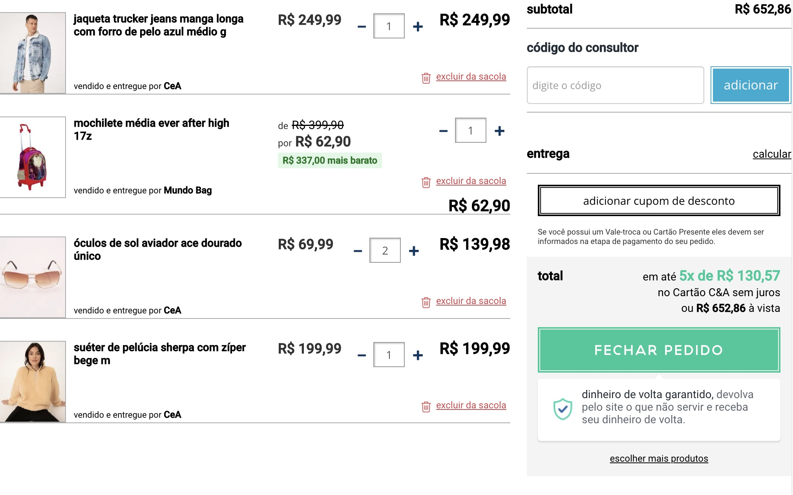
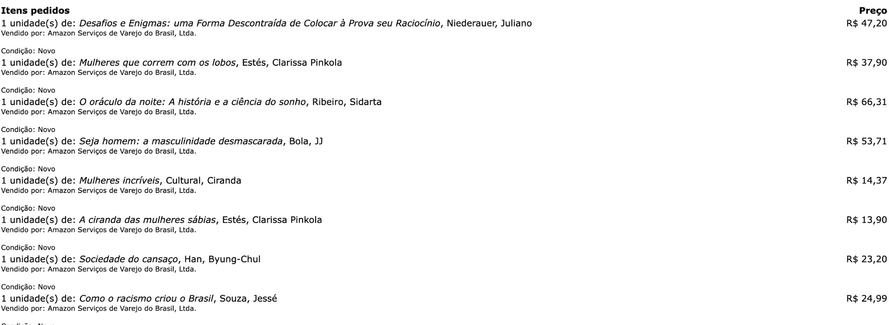
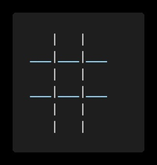
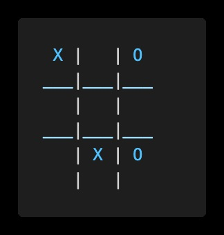

[](https://www.linkedin.com/in/marcus-vinicius-de-miranda)
[](https://www.instagram.com/marcusmiran/)
[](https://www.twitch.tv/lyazmat)

## Lista 3 de Exercício Javascript

> ### 1 - Crie uma função que escreva uma mensagem informando se um número é par ou ímpar.
```
Exemplo 1:

    Entrada:  
        2  
    Saída:  
        O número 2 é par  
	
Exemplo 2:  

    Entrada:  
        77  
    Saída:  
        O número 77 é ímpar  
```

```javascript
let parImpar = (numero) => {
    console.log(`O número ${numero} é`, numero % 2 === 0 ? 'par' : 'impar');
}

parImpar(2);
parImpar(77);
```
<br>
  
> ### 2 - Crie uma nova função semelhante ao exercício anterior, porém agora ela deve retornar o texto que será usado por um console.log.
```
Exemplo 1:

    Entrada:
        2
    Saída:
        identificaParOuImpar(2) // retorna "par"
        O número 2 é par // retorno do console.log que chama a função
```

```javascript
let identificaParOuImpar = (numero) => {
    return `O número ${numero} é ${numero % 2 === 0 ? 'par' : 'impar'}`;
}

console.log(identificaParOuImpar(2));
```
<br>

> ### 3 - Crie uma função que inverte a ordem dos itens de um array:
```
Exemplo 1:

    Entrada:
        ["Abacaxi", "Uva", "Banana", "Maçã", "Goiaba"]
    Saída:
        ["Goiaba", "Maçã", "Banana", "Uva", "Abacaxi"]

Exemplo 2:

        Entrada:
            [10, 2, 45, 87, 99, 20, 1, 3]
        Saída:
            [3, 1, 20, 99, 87, 45, 2, 10]
```

```javascript
let inverterArray = (arr) => {
    let arr2 = [];
    // A função unshift adiciona o elemento no início do array, enquando a função push adiciona no final.
    for (let i in arr) arr2.unshift(arr[i])
    return arr2;
}

let arr = ['Abacaxi', 'Uva', 'Banana', 'Maçã', 'Goiaba'];
console.log(arr, '=>', inverterArray(arr));
```
<br>

> ### 4 - Crie uma função que retorne a soma entre dois números.
```
Exemplo 1:

    Entrada:
        soma(3, 4)
    Saída:
        3 + 4 = 7
```

```javascript
let soma = (a, b) => {
    return a + b;
}

let a = 3, b = 4;
console.log(`${a} + ${b} = ${soma(a, b)}`);
```
<br>

> ### 5 - Faça uma função que irá receber um array de ingredientes e retornar um log com a mensagem de saída:
```
Exemplo 1:

    Entrada:
        ["Pão", "Carne", "ovo", "bacon", "Mussarela", "Presunto", "Alface", "Tomate", "Batata Palha"]
    Saída:
        Pão, Carne, ovo, bacon, Mussarela, Presunto, Alface, Tomate e Batata Palha
```

```javascript
let mostraIngredientes = (ingredientes) => {
    let resultado = ingredientes.reduce((resultado, ingrediente, index, arr) => {
        // Perceba que o último item não é separado por vírgula, mas sim pela letra "e"
        if (index != arr.length - 1) return resultado + ', ' + ingrediente;
        else return resultado + ' e ' + ingrediente;
    });
    console.log(resultado);
}

let ingredientes = ['Pão', 'Carne', 'Ovo', 'Bacon', 'Mussarela', 'Presunto', 'Alface', 'Tomate', 'Batata Palha'];

mostraIngredientes(ingredientes);
```
<br>

> ### 6 - Complemente o exercício anterior com outra função que quando chamada irá adicionar o ingrediente informado como parâmetro ao array de ingredientes e escreve uma nova mensagem de saída:
```
Exemplo 1:

    Entrada: 
        array: ["Pão", "Carne", "ovo", "bacon", "Mussarela", "Presunto", "Alface", "Tomate", "Batata Palha"]
        adicionarIngrediente("Milho")
    Saída:
        Pão, Carne, ovo, bacon, Mussarela, Presunto, Alface, Tomate, Batata Palha e Milho
```

```javascript
let mostraIngredientes = (ingredientes) => {
    let resultado = ingredientes.reduce((resultado, ingrediente, index, arr) => {
        if (index != arr.length - 1) return resultado + ', ' + ingrediente;
        else return resultado + ' e ' + ingrediente;
    });
    console.log(resultado);
}

let ingredientes = ['Pão', 'Carne', 'Ovo', 'Bacon', 'Mussarela', 'Presunto', 'Alface', 'Tomate', 'Batata Palha'];

let adicionarIngrediente = (ingrediente) => {
    ingredientes.push('Milho');
    mostraIngredientes(ingredientes);
}

adicionarIngrediente('Milho');
```
<br>

> ### 7 - Crie uma função que receba os dados: Nome, idade e endereço e retorne um objeto com essas propriedades.
```
Exemplo 1:

    Entrada: 
        preencherNome("Camila", 23, "Rua dos Andradas, 21")
    Saída:
        {
            nome: "Camila",
            idade: 23,
            endereco: "Rua dos Andradas, 21"
        }
```

```javascript
let preencherNome = (nome, idade, endereco) => {
    return { nome: nome, idade: idade, endereco: endereco }
};

console.log(preencherNome('Camila', 23, 'Rua dos andradas, 21'));
```
<br>

> ### 8 - Crie uma função que retorne a soma de todas as quantidades exibidas no carrinho abaixo:
<p align="center">
  
</p>

```javascript
let quantidades = (cesta) => {
    return cesta.reduce((resultado, produto, index, arr) => resultado + produto.quantidade, 0)
}

let produto1 = {
    descricao: 'jaqueta trucker jeans manga longa com forro de pelo azul médio g',
    valor: 249.99, valor_original: 249.99, empresa: 'C&A', quantidade: 1, imagem: 'link para foto'
}

let produto2 = {
    descricao: 'mochila média ever after high 17z',
    valor: 62.90, valor_original: 399.99, empresa: 'Mundo Bag', quantidade: 1, imagem: 'link para foto'
}

let produto3 = {
    descricao: 'óculos de sol aviador ace dourado único',
    valor: 69.99, valor_original: 69.99, empresa: 'C&A', quantidade: 2, imagem: 'link para foto'
}

let produto4 = {
    descricao: 'suéter de pelúcia sharpe com zíper bege m',
    valor: 199.99, valor_original: 199.99, empresa: 'C&A', quantidade: 1, imagem: 'link para foto'
}

let cesta = [produto1, produto2, produto3, produto4]

console.log(quantidades(cesta));
```
<br>

> ### 9 - Crie as funções acima utilizando array functions
<br>

```javascript
// já feito com array functions 
```
<br>

> ### 10 - Faça uma função que retorne o dobre dos números do array abaixo.
```
[ 0, 2, 98, 75, 23, 18, 31, 7, 1 ]
```

```javascript
let dobro = (arr) => {
    return arr.map((x) => x * 2);
}

let numeros = [0, 2, 98, 75, 23, 18, 31, 7, 1]

console.log(dobro(numeros));
```
<br>

> ### 11 - Faça uma função que retorne todas as frutas que tenham a letra "o"
```
[ "Abacaxi", "Uva", "Maçã", "Goiaba", "Abacate", "Acerola"]
```

```javascript
let temO = (frutas) => {
	// Utilizando toLowerCase() para considerar maiusculas também
	return frutas.filter((fruta) => fruta.toLowerCase().indexOf('o') > -1);
}

let frutas = ['Abacaxi', 'Uva', 'Maçã', 'Goiaba', 'Abacate', 'Acerola']

console.log(temO(frutas));
```
<br>

> ### 12 - Faça uma função que retorne a primeira fruta que tenha a letra "o" 
```
[ "Abacaxi", "Uva", "Maçã", "Goiaba", "Abacate", "Acerola"]
```

```javascript
let primeiraO = (frutas) => {
    return frutas.find((fruta) => fruta.toLowerCase().indexOf('o') > -1);
}

let frutas = ['Abacaxi', 'Uva', 'Maçã', 'Goiaba', 'Abacate', 'Acerola']

console.log(primeiraO(frutas));
```
<br>

> ### 13 - Faça o somatório de todos os valores do array abaixo, utilizando reduce
```
[1, 2, 3, 4, 5, 6]
```

```javascript
let soma = (numeros) => {
    return numeros.reduce((total, x) => total + x, 0);
}

let numeros = [1, 2, 3, 4, 5, 6];
console.log(soma(numeros));
```
<br>

> ### 14 - Faça uma função que retorne apenas as idades das pessoas, dado o objeto abaixo:
```
    [
        { name: 'Camila', age: 17 },
        { name: 'Jorge', age: 13 },
        { name: 'Marcia', age: 56 },
        { name: 'Barbara', age: 24 },
        { name: 'Natan', age: 67 },
        { name: 'Pablo', age: 65 }
    ];
```

```javascript
let idades = (arr) => {
    return arr.map((pessoa) => pessoa.age);
}

let arr = [
    { name: 'Camila', age: 17 },
    { name: 'Jorge', age: 13 },
    { name: 'Marcia', age: 56 },
    { name: 'Barbara', age: 24 },
    { name: 'Natan', age: 67 },
    { name: 'Pablo', age: 65 }
]

console.log(idades(arr));
```
<br>

> ### 15 - Resolver as funções anteriores agora utilizando apenas array function
```javascript
// já estão com array function 
```
<br>

> ### 16.1 - Crie uma função que una os objetos abaixo em um outro objeto chamado pessoa
```
primeiroNome: { nome: 'João' }
sobrenome: { sobrenome: 'da Silva' }
```

```javascript
let unirNome = (nome, sobrenome) => Object.assign({}, primeiroNome, sobrenome);

let primeiroNome = { nome: 'João' }, sobrenome = { sobrenome: 'da Silva' };

let pessoa = unirNome(primeiroNome, sobrenome);
console.log(pessoa);
```
<br>

> ### 16.2 - Crie uma função que crie um novo objeto alterando apenas as propriedades abaixo:
```
produto: {
    nome: "X-Tudo",
    ingredientes: ["Pão", "Carne", "ovo", "bacon", "Mussarela", "Presunto", "Alface", "Tomate", "Batata Palha"],
    servePessoas: 1,
    valor: 24.98,
    valorPromocional: 16.98,
    maisVendido: true
}

Alterar o valor do produto para 35.00 e o valor promocional deve ser o valor do produto com 10% de desconto.
```

```javascript
let mudarValor = (produto, valor, desconto) => {
    return Object.assign({}, produto, {
        valor: valor,
        valorPromocional: valor * (1 - desconto / 100)
    });
}

let produto = {
    nome: 'X-tudo',
    ingredientes: ['Pão', 'Carne', 'ovo', 'bacon', 'Mussarela', 'Presunto', 'Alface', 'Tomate', 'Batata Palha'],
    servePessoas: 1,
    valor: 24.98,
    valorPromocional: 16.98,
    maisVendido: true
}

produto = mudarValor(produto, 35.00, 10);
console.log(produto);
```
<br>

> ### 17 - Faça uma função que retorne o primeiro produto com valor entre 50 e 60 reais.

<p align="center">
  
</p>

```javascript
let filtroPreco = (cesta) => cesta.find((produto) => produto.preco >= 50 && produto.preco <= 60)

let cesta = [
    { quantidade: 1, descricao: 'Desafios e Enigmas ...', vendido: 'Amazon', preco: 47.20 },
    { quantidade: 1, descricao: 'Mulheres que correm ...', vendido: 'Amazon', preco: 37.90 },
    { quantidade: 1, descricao: 'O oráculo da noite ...', vendido: 'Amazon', preco: 66.31 },
    { quantidade: 1, descricao: 'Seja homem: ...', vendido: 'Amazon', preco: 53.71 },
    { quantidade: 1, descricao: 'Mulheres incríveis ...', vendido: 'Amazon', preco: 14.37 },
    { quantidade: 1, descricao: 'A ciranda das mulheres ...', vendido: 'Amazon', preco: 13.90 },
    { quantidade: 1, descricao: 'Sociedade do cansaço', vendido: 'Amazon', preco: 23.20 },
    { quantidade: 1, descricao: 'Como o racismo ...', vendido: 'Amazon', preco: 24.99 }
]

console.log(filtroPreco(cesta));
```
<br>

> ### 18 - Utilizando o objeto criado no exercício anterior, faça uma função que retorne a soma dos itens na lista de compras (utiliza o reduce)
```javascript
let total = (cesta) => cesta.reduce(
    (resultado, produto) => resultado + produto.preco * produto.quantidade, 0)

let cesta = [
    { quantidade: 1, descricao: 'Desafios e Enigmas ...', vendido: 'Amazon', preco: 47.20 },
    { quantidade: 1, descricao: 'Mulheres que correm ...', vendido: 'Amazon', preco: 37.90 },
    { quantidade: 1, descricao: 'O oráculo da noite ...', vendido: 'Amazon', preco: 66.31 },
    { quantidade: 1, descricao: 'Seja homem: ...', vendido: 'Amazon', preco: 53.71 },
    { quantidade: 1, descricao: 'Mulheres incríveis ...', vendido: 'Amazon', preco: 14.37 },
    { quantidade: 1, descricao: 'A ciranda das mulheres ...', vendido: 'Amazon', preco: 13.90 },
    { quantidade: 1, descricao: 'Sociedade do cansaço', vendido: 'Amazon', preco: 23.20 },
    { quantidade: 1, descricao: 'Como o racismo ...', vendido: 'Amazon', preco: 24.99 }
]

console.log(total(cesta));
```
<br>

> ### 19 - Utilizando o objeto criado no exercício anterior, faça uma função que retorne o nome dos produtos que tenham o valor maior do que 25 reais.
```javascript
let nomeProdutos = (cesta) => cesta.reduce((resultado, produto) => {
    if (produto.preco > 25) resultado.push(produto.descricao)
    return resultado
}, [])

let cesta = [
    { quantidade: 1, descricao: 'Desafios e Enigmas ...', vendido: 'Amazon', preco: 47.20 },
    { quantidade: 1, descricao: 'Mulheres que correm ...', vendido: 'Amazon', preco: 37.90 },
    { quantidade: 1, descricao: 'O oráculo da noite ...', vendido: 'Amazon', preco: 66.31 },
    { quantidade: 1, descricao: 'Seja homem: ...', vendido: 'Amazon', preco: 53.71 },
    { quantidade: 1, descricao: 'Mulheres incríveis ...', vendido: 'Amazon', preco: 14.37 },
    { quantidade: 1, descricao: 'A ciranda das mulheres ...', vendido: 'Amazon', preco: 13.90 },
    { quantidade: 1, descricao: 'Sociedade do cansaço', vendido: 'Amazon', preco: 23.20 },
    { quantidade: 1, descricao: 'Como o racismo ...', vendido: 'Amazon', preco: 24.99 }
]

console.log(nomeProdutos(cesta));
```
<br>

> ### Desafio: Busca por voo
```
Vamos construir um conjunto de funções que vai salvar os dados de entrada sobre voos que estão para acontecer e 
depois podemos buscar algumas informações sobre os dados armazenados.

Deve ser criada uma função que quando chamada seja passado os seguintes valores do voo como parâmetro: código, 
horário de partida, quantidade de passageiros, valor da passagem, origem e destino. Lembrete: qual a melhor 
estrutura para representar esses dados? Deve ser possível armazenar mais de um objeto. Sempre que a função for 
chamada, deve ser adicionado um item ao final,  com valores corretos.

Exemplo:

    Entrada:
        cadastrarVoo(1, "10:32", 120, 1220, "SP", "RE")

Deve ser criada uma função que quando chamada deve retornar todos os voos disponíveis para a origem informada.

    Exemplo:
    
        Entrada: buscarVooOrigem("SP")

Deve ser criada uma função que quando chamada deve retornar todos os voos disponíveis para o destino informado.

    Exemplo:
    
        Entrada: buscarVooDestino("SP")
```

```javascript
let voos = [];

let cadastrarVoo = (codigo, partida, passageiros, valor, origem, destino) => {
    voos.push({
        codigo: codigo, partida: partida, passageiros: passageiros,
        valor: valor, origem: origem, destino: destino
    });
}

let buscaVooOrigem = (origem) => voos.filter((voo) => voo.origem === origem);

let buscaVooDestino = (destino) => voos.filter((voo) => voo.destino === destino);

let buscaVooOrigemDestino = (origem, destino) => voos.filter((voo) => (voo.origem === origem && voo.destino === destino));

cadastrarVoo(1, '10:32', 120, 1220, 'SP', 'RJ');
cadastrarVoo(2, '07:41', 80, 990, 'SP', 'CE');
cadastrarVoo(3, '04:25', 120, 820, 'SP', 'MT');
cadastrarVoo(4, '03:36', 110, 700, 'RJ', 'SP');
cadastrarVoo(5, '17:07', 60, 1800, 'BA', 'RJ');
cadastrarVoo(6, '18:45', 85, 1150, 'SC', 'RJ');
cadastrarVoo(7, '22:18', 105, 1400, 'SC', 'SP');
cadastrarVoo(8, '00:14', 70, 1300, 'AC', 'RJ');
cadastrarVoo(9, '03:14', 40, 300, 'SP', 'SC');

console.log(buscaVooOrigem('RJ'));
console.log(buscaVooDestino('SP'));
console.log(buscaVooOrigemDestino('SP', 'SC'));
```
<br>

> ### Desafio: Jogo da Velha:
```
Vamos construir um jogo da velha, mas para isso algumas funções devem ser criadas. Siga cada exercício dessa etapa, 
para concluir o desafio

Para cada jogada feita o programa deve ser capaz de escrever como está a visão do tabuleiro. Crie uma função que irá 
"desenhar" o jogo da velha sempre que for chamada.

Exemplo:

    Entrada:
        jogoVelha = [['', '', ''], ['', '', ''], ['', '', '']]
        desenhaJogoVelha()
    Saída:
```

<p align="center">
  
</p>

```
Exemplo 2:

    Entrada:
        jogoVelha = [['X', '', 'O'], ['', '', ''], ['', 'X', 'O']]
        desenhaJogoVelha()
    Saída:
```

<p align="center">
  
</p>

```
● Faça uma função chamada jogar, que deve receber como parametro o número da linha (1 a 3), o número da coluna (1 a 3) 
e qual vai ser a jogada no momento ("X" ou "O"). Toda vez que essa função for chamada, a matriz jogoDaVelha deve ser 
preenchida corretamente, e o jogo da velha deve ser "desenhado" no console.

● Faça uma função que retorne uma mensagem de erro com o texto "Jogada Inválida" sempre que a função jogar for chamada 
descumprindo alguma das regras abaixo:

    ○ Número da linha com valor diferente de 1, 2 ou 3
    ○ Número da coluna com valor diferente de 1, 2 ou 3
    ○ Valor da jogada diferente de "X" ou "O"
    ○ Informar uma posição que não esteja vazia.

● Faça funções que identifiquem ao final de uma jogada qual a situação do Jogo:

    ○ "Jogo em Andamento!"
    ○ "O Jogador X ganhou"
    ○ "O Jogador O ganhou"
    ○ "O jogo deu Velha"
```

```javascript
let jogoVelha = [
    [null, null, null],
    [null, null, null],
    [null, null, null]
]

// Adicionei a numeração das linhas e colunas para ficar mais fácil o entendimento
let desenhaJogoVelha = () => {
    console.log('   1   2   3  ');
    console.log(`1  ${jogoVelha[0][0] || ' '} | ${jogoVelha[0][1] || ' '} | ${jogoVelha[0][2] || ' '} `);
    console.log('  ___|___|___');
    console.log(`2  ${jogoVelha[1][0] || ' '} | ${jogoVelha[1][1] || ' '} | ${jogoVelha[1][2] || ' '} `);
    console.log('  ___|___|___');
    console.log(`3  ${jogoVelha[2][0] || ' '} | ${jogoVelha[2][1] || ' '} | ${jogoVelha[2][2] || ' '} `);
    console.log('     |   |   ');
}

// Função para verificar os erros propostos
let verificarErro = (linha, coluna, marcado) => {
    let msg = [], posicoes = [1, 2, 3], macadores = 'XO';
    // Linha de 1 a 3
    if (posicoes.indexOf(linha) === -1) {
        msg.push('O número da linha deve estar entre 1 e 3, incluindo os mesmos.');
    }
    // Coluna de 1 a 3
    if (posicoes.indexOf(coluna) === -1) {
        msg.push('O número da coluna deve estar entre 1 e 3, incluindo os mesmos.');
    }
    // Marcadores 'X' ou 'O'
    if (macadores.indexOf(marcado) === -1) {
        msg.push('O valor deve ser X ou O.')
    }
    // Posição já preenchida
    if (posicoes.indexOf(linha) > -1 && posicoes.indexOf(coluna) > -1 && jogoVelha[linha - 1][coluna - 1] !== null) {
        msg.push('Posição já preenchida.')
    }
    // Se a quantidade de msg de erro forem zero, valida como verdadeiro (true)
    // Senão imprime no console todos os erros e retorna false
    if (msg.length === 0) return true;
    else {
        console.log(msg.reduce((result, m) => result + '\n' + m), '');
        return false;
    }
}

// Função para verificar a situação do jogo
let validarSituacao = (linha, coluna, marcador) => {
    // h quantidade do marcador na linha, v quantidade do marcador na coluna    
    let h = 0, v = 0, blank = 0;
    
    // d1 e d2 são a quantidade do marcador na diagonal principal e secundária, respectivamente
    let d1 = [jogoVelha[0][0], jogoVelha[1][1], jogoVelha[2][2]].filter((x) => x === marcador);
    let d2 = [jogoVelha[0][2], jogoVelha[1][1], jogoVelha[2][0]].filter((x) => x === marcador);
    
    // velha respresenta se todos os campos foram marcados sem ganhador
    // utilizado um find para verificar se ainda existe null em alguma posição
    // caso não exista, retorna undefined
    let velha = jogoVelha.find(x => x.reduce((b, y) => {
        if (y === null) b = true
        return b
    }, false) === true);
    
    for (i in [1, 2, 3]) {
        if (jogoVelha[linha - 1][i] === marcador) h += 1;
        if (jogoVelha[i][coluna - 1] === marcador) v += 1;
    }
    
    // O jogador ganha se seu marcador, após a jogada, for marcado em 3 posições na linha, coluna ou diagonal.
    // Se não ganhou, verifica se deu velha.
    // Caso contrário, ainda há posições para serem marcadas.
    if (d1.length === 3 || d2.length === 3 || h === 3 || v === 3) console.log(`O jogador ${marcador} ganhou!`);
    else if (velha === undefined) console.log('O jogo deu velha!');
    else console.log('Jogo em andamento!');
}

let jogar = (linha, coluna, marcador) => {
    // Aceita x, X, o ou O
    marcador = marcador.toUpperCase();
    if (verificarErro(linha, coluna, marcador)) {    
        // Só marca se não houver erro
        jogoVelha[linha - 1][coluna - 1] = marcador;
        // Valida a situação após marcar
        validarSituacao(linha, coluna, marcador);
    }
    desenhaJogoVelha();
}

desenhaJogoVelha();
```
