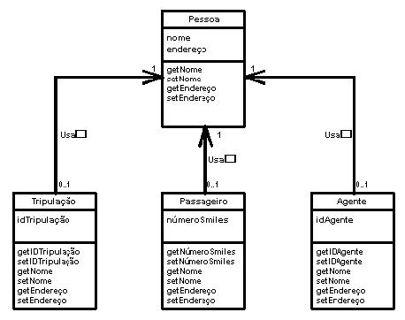
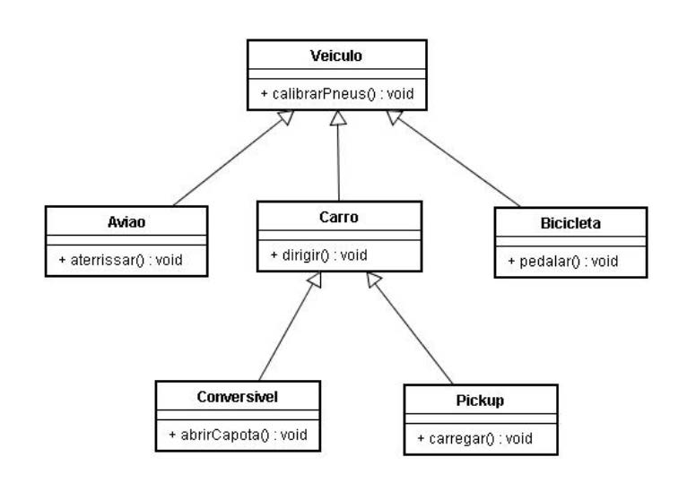

[](https://www.linkedin.com/in/marcus-vinicius-de-miranda)
[](https://www.instagram.com/marcusmiran/)

## Lista 4 de Exercício Javascript

> ### 1 - Criar classes para as entidades abaixo:

<p align="center">
  
</p>

```javascript
class Pessoa {
    constructor(nome, endereco) {
        this.nomePessoa = nome;
        this.enderecoPessoa = endereco;
    }

    get nome() {
        return this.nomePessoa;
    }

    set nome(nome) {
        this.nomePessoa = nome;
    }

    get endereco() {
        return this.enderecoPessoa;
    }

    set endereco(endereco) {
        this.enderecoPessoa = endereco;
    }
}

class Tripulacao extends Pessoa {
    constructor(nome, endereco, id) {
        super(nome, endereco);
        this.id = id;
    }

    get idTripulacao() {
        return this.id;
    }

    set idTripulacao(id) {
        this.id = id;
    }
}


class Passageiro extends Pessoa {
    constructor(nome, endereco, smiles) {
        super(nome, endereco);
        this.smiles = smiles;
    }

    get numeroSmiles() {
        return this.smiles;
    }

    set numeroSmiles(smiles) {
        this.smiles = smiles;
    }
}

class Agente extends Pessoa {
    constructor(nome, endereco, id) {
        super(nome, endereco);
        this.id = id;
    }

    get idAgente() {
        return this.id;
    }

    set idAgente(id) {
        this.id = id;
    }
}

let tripulante = new Tripulacao("Marcus", "Rua X", 12);
console.log(tripulante);

let passageiro = new Passageiro("Ana", "Rua Z", 100);
console.log(passageiro);

let agente = new Agente("Ricardo", "Rua H", 7);
console.log(agente);
```
<br>

> ### 2 - Crie as classes que representam o diagrama abaixo:

```
Adicione atributos que façam sentido.
```

<p align="center">
  
</p>

```javascript
class Veiculo {
    constructor(cor, peso, descricao) {
        this.cor = cor;
        this.peso = peso;
        this.descricao = descricao;
    }
    calibrarPneus() {}
}

class Aviao extends Veiculo {
    constructor(cor, peso, descricao, quantidadePassageiros) {
        super(cor, peso, descricao);
        this.quantidadePassageiros = quantidadePassageiros;
    }
    aterrisar() {}
}

class Bicicleta extends Veiculo {
    constructor(cor, peso, descricao, tipo) {
        super(cor, peso, descricao);
        this.tipo = tipo;
    }
    pedalar() {}
}

class Carro extends Veiculo {
    constructor(cor, peso, descricao, placa) {
        super(cor, peso, descricao);
        this.placa = placa;
    }
    dirigir() {}
}

class Conversivel extends Carro {
    constructor(cor, peso, descricao, placa, quantidadeAssentos) {
        super(cor, peso, descricao, placa);
        this.quantidadeAssentos = quantidadeAssentos;
    }
    abrirCapota() {}
}

class Pickup extends Carro {
    constructor(cor, peso, descricao, placa, combustivel) {
        super(cor, peso, descricao, placa);
        this.combustivel = combustivel;
    }
    carregar() {}
}
```
<br>

> ### 3 - Crie classes para representar uma lista de compras, onde teremos as seguintes entidades e funcionalidades:

```
    ● Um pedido é a representação de uma lista de compra, onde ele pode ter: um codigo,
    um conjunto de arrays, calcular o total da compra, aplicar desconto, adicionar novo
    item ao carrinho, aumentar ou reduzir a quantidade de um item no carrinho.

    ● Um item é a representação de um produto que faz parte da lista de compras, onde
    ele pode ter: um código, nome, quantidade e valor. Ele pode reduzir ou aumentar a
    quantidade de um item.

    Crie a classe Pedido que utilize a classe Item para construir os itens do pedido.
        - Para adicionar um novo item é preciso chamar Pedido.adicionarItem(novoItem)
        - Para aumentar a quantidade é preciso chamar Pedido.aumentarQuantidade(item)
        - Implemente as funcionalidades dos métodos criados.
```

```javascript
class Item {
    constructor(codigo, nome, quantidade, valor) {
        this.codigo = codigo;
        this.nome = nome;
        this.quantidade = quantidade;
        this.valor = valor;
    }

    aumentarQuantidade() {
        this.quantidade++;
    }

    diminuirQuantidade() {
        this.quantidade--;
    }
}

class Pedido {
    constructor(codigo, itens) {
        this.codigo = codigo;
        this.itens = itens;
        this.desconto = 0;
    }

    aplicarDesconto(desconto) {
        // Em percentual %
        this.desconto = desconto;
    }

    calcularTotal() {
        return this.itens.reduce((total, i) => total + i.quantidade * i.valor, 0, 0) * (1 - this.desconto / 100);
    }

    aumentarQuantidade(item) {
        item.aumentarQuantidade();
    }

    diminuirQuantidade(item) {
        item.diminuirQuantidade();
    }

    adicionarItem(novoItem) {
        this.itens.push(novoItem);
    }

    descricaoItens() {
        // Método para retornar a descricao dos itens, quantidade, valor e valor total de todos os itens em uma string
        return this.itens.map((i) => `${i.nome} - ${i.quantidade} x ${i.valor} = ${i.quantidade * i.valor}`).join('\n');
    }

}

let item0 = new Item(1, 'Camisa', 3, 30.00);
let item1 = new Item(2, 'Calça', 2, 120.00);
let pedido = new Pedido(1, [item0, item1]);

console.log('Pedido:');
console.log(pedido.descricaoItens());
console.log('Desconto:', pedido.desconto + '%');
console.log('Total', pedido.calcularTotal());

// Fazendo alterações no Pedido

// Diminuindo a quantidade do item1
pedido.diminuirQuantidade(item1);

// Adicionando novo item
let item2 = new Item(3, 'Sapato', 1, 290.00);
pedido.adicionarItem(item2);

// Aplicar desconto de 50%
pedido.aplicarDesconto(50);

console.log('Pedido Alterado:');
console.log(pedido.descricaoItens());
console.log('Desconto:', pedido.desconto + '%');
console.log('Total final:', pedido.calcularTotal());
```